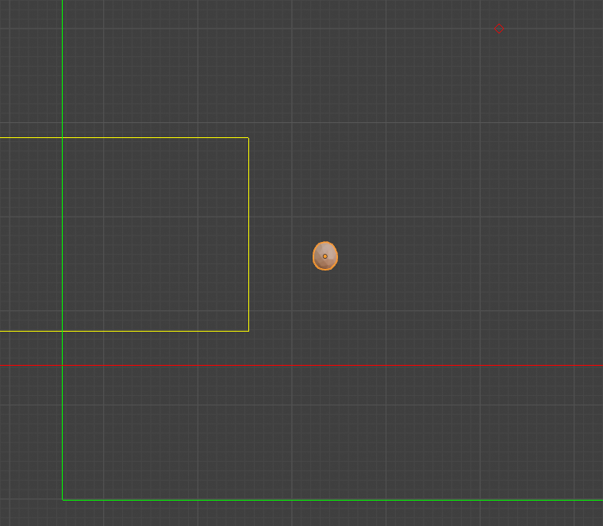

Egg
===

The egg isn't really meant to be used in Custom Maps, so working with it will be a bit strange.

First off to add an egg you can simply drag it into your map from the Asset Browser. All the basic properties for the egg will already be set, so don't worry about them. In Blender a "proxy" model will be shown for the egg. In-game it will look like the one from Map 1.

When selecting an egg, some bounds will be shown will be show in the upper right quadrant.

The green lines show the player bounds. If the player goes to the left or under the bounds, then the egg will respawn at it's original spawn point (where it was placed in the map).

The yellow lines show a box where if the egg is within it, it will shoot out fireworks. This is likely a quirk from the "Goal!!!" achievement.

The red line shows the egg respawn boundary. If the egg falls below this point then the egg will respawn at the position marked with a red diamond. 

.. important::

   **If the egg starts below the egg respawn boundry, then it will crash the game. I have added a check so if an egg is placed below this boundary, then it will simply not be added to the map, to avoid the crash.**

.. note::

   All this information has been gathered through trial and error, so while it should be largely correct, it might not be 100% precise.

The egg will not respawn when the player respawns. So if you are making speedrunning maps, the best solution might just be to make sure that the spawn point is outside the player bounds.

.. tip::

   If you are hitting the bounds of the map, since the egg location is so far out, have a look at the information on :doc:`Map Bounds <map_bounds>`.
