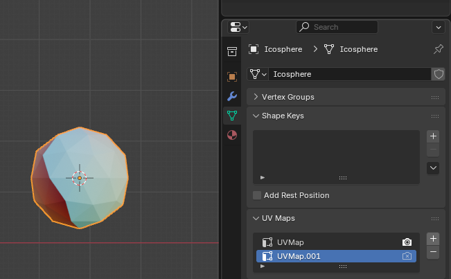

Gravity
=======

.. admonition:: Video
   :class: video

   There is a video of this guide `here <https://www.youtube.com/watch?v=21jtPt1Q_eU>`__.

Working the Gravity material is a bit confusing so heres a guide.

First make any model you want, and add the "Gravity" material.

Then go to the objects data properties and under "UV Maps", you can add another map.

Select the new UV Map and go to the UV editor. Here you can edit your UV Maps.

The first UV Map chooses the direction flow and speed of the particles. It looks best when all the UV Points are in the same position. The particles will be pulled towards the top left corner of the UV Map, but the Y-axis is flipped.

The second UV Map determines how the galaxy background and colors appear.

It is hard to describe in words, so have a look at the linked video and try to just play around with it!
