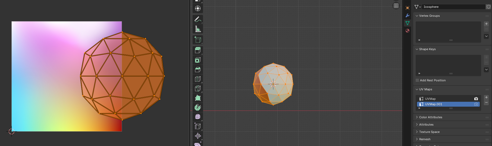
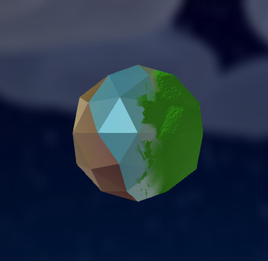

Moss
====

Adding moss is a bit confusing so heres a guide.

First make any model you want, add a texture and then add the "Moss" material.

Then go to the objects data properties and under "UV Maps", you can add another map.

.. figure:: moss1.png

Select the new UV Map and go to the UV editor. Here you can edit where the moss should appear.

Moss will appear on any UV-cordinate that has an X-value greater than 1 (aka past the right edge of the bounds).

You can now use the first UV Map to change how your model is textured, and use the second UV Map to change where moss appears!

