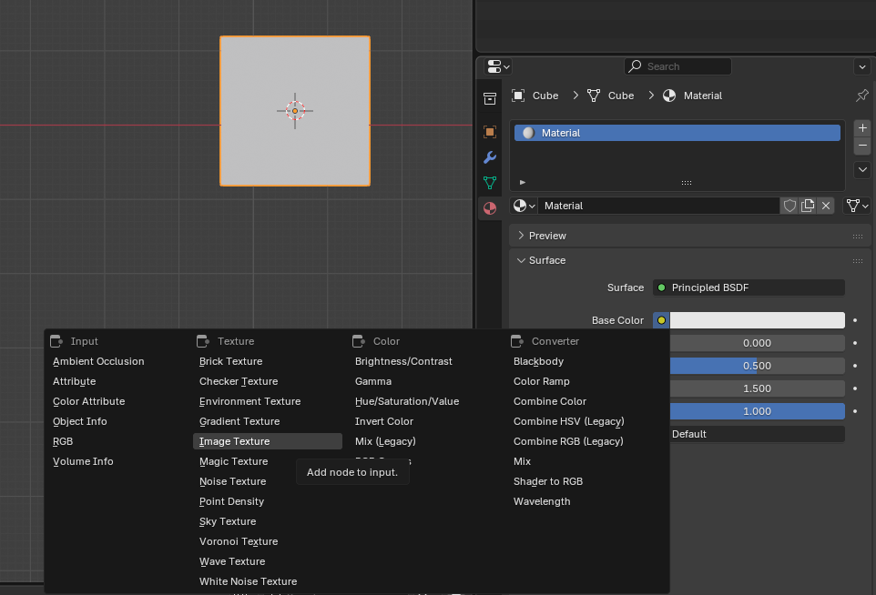

Modeling
========

Modeling is done mainly as you would regularly do in Blender.

Texturing
---------

You can texture your models. To use a texture on a model it must have a material that has an 'Image Texture' Node. You can easily do this by going to the materials on a mesh, adding a material, and on its 'Base Color' value you can select 'Image Texture' and then select an image. You can then edit how the texture is applied using UVs in the 'UV Editing' tab.

Textures will tile when the UV points exceed the normal 0-1 boundary.

.. warning::

   In-game when tiling a texture, it will only tile on each axis in pixel amounts that are powers of 2. So if your texture is 100px wide it will show the 100px and then 28 empty pixels and then tile the texture again.

.. tip::

  If you are using low resolution textures, like pixel art or a color pallette, and you are getting blurry textures. You can change how the texture appears by changing Interpolation on the material to 'Closest'. You might also want to use the 'Pixelated' Pogo Material, so it matches in-game.

Modifiers
---------

Modifers are automatically applied when a model is exported.

When using materials, you may see in-game that models appear alot smoother than they do in Blender. In Blender you can use 'shade smooth' to see what it would roughly look like in Pogostuck. To get more defined edges you can use an 'Edge Split' modifier with an angle of 0 degrees. To get smoother edges you can also apply a 'Bevel' modifier first with 1-2 segments and a low amount e.g. 0.001m - 0.006m. Tools to do this fast is made available, see :doc:`Object Tools <objects/object_tools>`

.. _assets:

Reusing Models
--------------

It is encouraged that when reusing models, you do it properly, so the exporting is faster, smaller file sizes, and so if you need to change all meshes you only need to change it once.

By default there is already some models that you can use that Superku has made avaible in the use of making Custom Maps. You can access these models in the Asset Browser.

To make your own Assets you can mark any mesh as an Asset and then use it through the Asset Browser. This can either be done within the same Blender file or you can make standalone Assets in different Blender files and then add your own Asset Library in Blender.
You can also use the same mesh on two objects by duplicating the object with ALT-D instead of SHIFT-D, which duplicates the object but reuses the mesh data.

Limitations
-----------

The model format that Pogostuck uses supports a maximum of 65k vertices.

