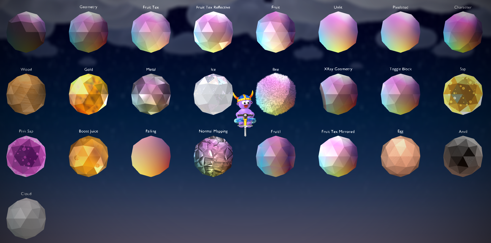

Entities
========

Entities include:

- Models (any regular Blender mesh)
- Sprites (can be made from the PogoBlend Add menu)
- Blocks (can be made from the PogoBlend Add menu)

All entities are just meshes. Models are regular meshes as you know them. Sprites are just a flat plane with a texture on it, and blocks are also flat planes with some pre defined settings.

.. seealso::

   :doc:`Modeling </modeling>` page for more information on how to make the meshes that entities use.

Entities have materials, actions, and flags.

Materials
---------

The material on an entity determines how it will look in-game. It currently has not effect on how it is displayed inside Blender. Some materials allows changing the brightness (technically it's "ambient", how much sunlight the material should reflect), and some other value (greyscale, transparency).

Below is an in-game image of the available materials, aswell as a list of their names and descriptions which is also available in the add-on by hovering your mouse over each material.

   *In-game image of the available materials with a gradient texture applied. Note: the 'Sap', 'Pink Sap' and 'Boost Juice' materials have a bubbles texture instead. Also, the 'Normal Mapping' material is using a second texture, a normal map, and it will look different depedning on the normal map you are using.*

.. datatemplate:yaml:: ../../pogo_classes/materials.yaml
    :template: ./objects/materials.tmpl

Custom Materials
^^^^^^^^^^^^^^^^

You can make Custom Materials using HLSL and ``.fx`` files. There is 5 different slots for Custom Materials. When an entity has a Custom Material applied, there will be a button that will open a text editor where you can edit the shader. The first time you do this the file will be filled in with a template that you can delete or build out from. If you would like to edit the shader with an external editor simply save the text block in Blender to an external file, or create a file called 'customMaterialX.fx' (X is the custom material slot) in the same folder as your Blender file.

When you edit/add a Custom Material, you might need to restart Pogostuck so it can setup auto reloading of that material. When that is setup, you just need to export the map and the shader will be updated instantly, you won't even have to reload the map! Once you are done mapping and editing Custom Materials, you might also want to restart Pogostuck again, because otherwise other Custom Maps using Custom Materials will use the ones you've made instead of theirs.

In order to use the alpha value in your pixel shader, you should set the 'alphaBlendEnable' value in the technique to true.

.. caution::

  If you make a mistake in the shader, a default shader will be used instead.

.. admonition:: Help Wanted

   Currrently there is no deeper guide on how to write Custom Materials. If you have some knowledge about it, consider :doc:`contributing <../contribution>` a guide! There might also be some useful information on the `Gamestudio A8 Manual <http://manual.conitec.net/>`__ under the "MATERIAL" section, or have a look at ``appAGeoDefault.fx``, the 'Geometry' material, in the BaseMap.

Actions
-------

Actions change the behavior of the entity. Some actions might have additional options that allow you to change the specifics of how the action should behave. An option is either a flag, an on or off option, or a 'skill' which is just a decimal number.

An entity can have a maximum of two actions. If you are using two actions please note that some of the options might overlap and that using two actions might give inconsistent behavior.

Below is a list of the avaiable actions. The descriptions for the actions will be available in the add-on, but unfortunately the descriptions for the options are currently not.

.. warning::

   Some flags in the action options might overlap with the 'Bonk' and 'Ice' flags.

.. datatemplate:yaml:: ../../pogo_classes/actions.yaml
    :template: ./objects/actions.tmpl

.. _flags:

Flags
-----

Flags are on or off values, and change certain things about the entity.

**Invisible** makes the entity invisible.

**Shadow** gives a glow shadow around the entity. It does this by just adding a blurry version of it in the background, so this doesn't work if the background is blocked or the background flag is on.

**Background** places the entity in the background and blurs it.

**Collision** makes the entity collideable. See :ref:`collisions`.

The following flags only has an effect if the entity is collideable:

**Auto Collision** generates a collision that matches the entities sideview. See :ref:`collisions`.

**Kill** kills the player on contact with the entity.

**Ice** makes the player glide on the entity like ice.

**Bonk** makes the player bonk on contact with the entity, even if it's the pogostick that makes contact.

.. _collisions:

Collisions
----------

You can enable collision on any entity. When collisions is enabled the player will collide with the entity. The collision happens where the Y-position is equal to 0, so make sure that you position collideable entities on the XZ-plane.

In case you just want the player to collide with an entity as it appears on it's sideview you can enable **Auto Collision** which will auto-generate a collider for the entity and place it correctly. If you want to preview or modify this collision you can generate the collision yourself by selecting the entity that you want to create a collider for and under the 'Object' panel you can select ``PogoBlend -> Create a Pogostuck Collider``.

.. note::

   Automatic colliders are not guarenteed correct so if your collisions are acting funky, try generating the collider manually and inspect it to look for any problems.

.. warning::

   Sometimes when colliding with a rotated entity, the player might fall straight through it. If this is the case, just rotate the mesh and not the entity, or use Auto Collision as that won't have any rotation on it.

.. _overrides:

Overrides
---------

The auto-generated :ref:`assets <assets>` from Pogostuck will have some overrides applied to them. Overrides just tells the add-on to build the entity in a certain way. For these assets it is the filename that is overriden, and that means that the mesh will not be exported to a model and the entity will instead use the file with the name given by the override. The same goes for just about any field on an entity, like materials. For normal use cases you won't have to set these overrides manually, but it's good to know what they are. You can enable viewing all overrides in the :doc:`preferences </preferences>`. If a field is overridden it will be shown no matter the option in your preferences.
